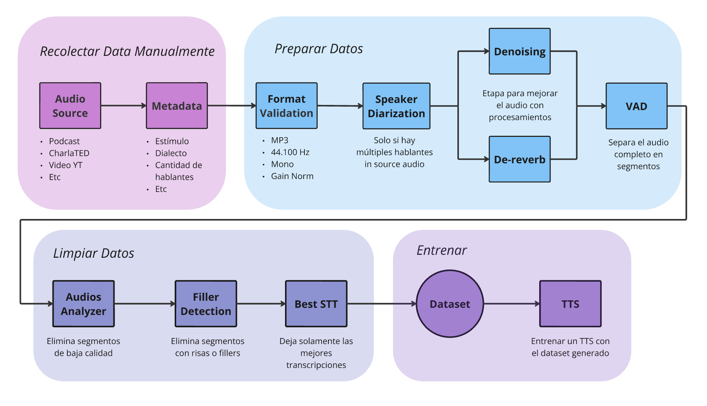

# ASR Dataset Generator
Este repositorio contiene un algoritmo que permite identificar las mejores secciones de un audio de gran duración. Esto permite generar dataset de mayor calidad para utilizar en diferentes tareas de ASR.

## Organización estructura código
### Carpetas con datos
Este es el nombre y función de las carpetas donde se van a almacenar los datos, se tienen que crear para poder ejecutar `main.py`. Están ocultas por git para no trackear datos. Con el archivo `Utils/create_folder_estructure.py` se pueden crear todas las carpetas de forma automática. Todas las carpetas listadas a continuación están dentro de la carpetas *Datos*.

- *Audio_to_Process*: Donde poner los nuevos audios que se van a ir agregando. Una vez que se procesen queda en la carpeta de audios raw y esta carpeta queda vacía.
- *Audios Raw*: Carpeta con audios a procesar (podcast, videos, etc). Va a tener un ID y un nombre separados por un `_`. Ej, 0000_Caja-Negra-Indio-Solari. 
- *Audios_Denoise*: Carpeta donde van los audios denoiseados
- *Audios_VAD*: Dentro de esta carpeta hay subcarpetas con los recortes de los audios largos, va a tener el ID del audio general y un ID por chunk que sea de 4 dígitos (no creo que tengamos un audio con mas de 9999 chunks). Entonces quedaría por ejemplo, "Audios VAD/0000_Caja-Negra-Indio-Solari/0000_0001.mp3"
- *Audios_Clean*: Segmentos de audios que pasaron por el filtro de (AAC, SD, FD). Mantienen el mismo indice que la sección de VAD, por ejemplo si los primeros dos audio no pasan el filtro el primer audio en esta sección es, "Audios Clean/0000_Caja-Negra-Indio-Solari/0000_0001.mp3"
- *Audios_Transcript*: Segmentos de audios con las mejores transcripciones. El ejemplo es el mismo que en Audios Clean. Va a haber una carpeta llamada transcrips, donde va a estar el transcript.csv específico de la entrevista/podcast con el nombre. Sería "Audios Transcript/0000_Caja-Negra-Indio-Solari/0000_0004.mp3" y "Audios Transcript/transcripts/0000_Caja-Negra-Indio-Solari"
- *Dataset*: Agrupar todos los mejores fragmentos. Sin subdivisión de carpetas se mezclan todos los datos y se ajustan los indices para tener un Dataset único. 

### Carpetas del código
- *Denoising (DEN)*: En esta carpeta va a estar todos los procesamientos necesarios para mejorar el audio. Por ahora solo se le va a pasar deep_net.
    - Input: path_audio_raw
    - Output: Nada, guarda en la carpeta "Audios_Denoise" el audio denoiseado con el mismo nombre

- *Voice Activity Detection (VAD)*: Separar los audios y agrupar formando segmentos de cierta longitud. Se va a específicar una duración mínima y máxima que se tiene que respetar. Valores default min_dur=15seg, max_dur=30seg (hacer unas pruebas y ver si hay casos que por el recorte quedarían fuera de esta condición).
    - Inputs: (path_audio_denoise, min_dur, max_dur)
    - Output: Nada, hace el proceso y me lo guarda en la carpeta "Audios VAD" acorde al formato especificado.

- *AudioAnalyzer (AA)*: Determina la calidad de los audios. Se procesa solo los fragmentos individuales ya separados por el VAD y me devuelve si es válido o no en función a los thresholds definidos de que es un audio aceptable.
    - Input: path_audio
    - Output: True or False

- *Filler Detection (FD)*: Se encarga de detectar las risas, pausas, repeticiones y muletillas ("ehhh", "mmmm").
    - Input: path_audio 
    - Output: True or False

- *Speech-To-Text (STT)*: Hacer la transcripción automática y tomar solo los mejores casos.
    - Input: path_audio 
    - Output: Nada, me guarda los mejores en la carpeta "Audios_Transcript" y me genera el csv con las transcripciones

- *Utils*: Carpeta para todas la funciones auxiliares para ordenar los datos, generar los csv, normalizar nombres de los audios, normalizar formato de los audios, etc. Es decir, todo el código que no se pueda agrupar a los problemas específicos de las carpetas anteriores. 

- *Tests*: Funcionalidad para evaluar el funcionamiento de la cadena.  

### Archivos principales
Estos archivos se encuentran en el directorio principal:

- `metadata.csv`: Este CSV tiene la información del dataset. Al agregar un audio al dataset se tiene que agregar una línea en este csv con los siguientes campos:
    * ID (int): Numero que se incrementa en función del anterior
    * Estímulo (string): Nombre de la fuente de donde se sacó el audio
    * Dialecto (string): String con la región del acento de la persona en el audio. Las categorías son (Porteño, Norte, ...)
    * Tipo (string): El formato de contenido del que se sacó el audio (Podcast, Entrevista, Charla Ted, etc) 
    * Género (int): Numero que corresponde al siguiente mapeo {Hombre:0, Mujer:1, Otro:2}
    * Lenguaje (string): Tipo de lenguaje que se usa un el audio base. Las opciones son (Formal o Informal)  
    * Audios_VAD (int): Número de segmentos que genero el VAD. Se completa después automáticamente
    * Audios_Clean (int): Número de audios que pasaron AA y FD. Se completa después automáticamente
    * Audios_Transcript(int): Número de audios con transcripción aceptable. Se completa después automáticamente
- `transcript.csv`: El resultado con el path a los mejores audios y su transcripción. Es la combinación de los transcripts individuales de cada fuente de audio 
- `requirements.txt`': Dependencias del proyecto, separadas por sub modulo
- `main.py`: Ejecuta toda la cadena de procesos, desde "Audios to Process" a "Audios Transcript" 

## Orden la cadena
El diagrama de flujo del proceso entero es el siguiente:



Este repositorio contiene la funcionalidad para la etapa de *Preparar datos* y *Limpiar datos*.

## Dependencias
Vamos a hacer un environment nuevo para este proyecto, si tienen algo con pytorch o cualquier ML framework instalar las versiones para usar CPU así nos aseguramos que les puede correr a todos (avisar si no tiene versión con CPU).

Seguramente se repitan muchas dependencias, pongan las versiones de los paquetes necesarios para que funcione su función y vemos si funciona para todos, sino vamos debugeando. Si hay algo externo que hay que instalar para que funcione dejarlo en esta sección.

### Dependencias externas
Whisper necesita ffmpeg en tu sistema para funcionar, acá dejo los comandos para instalarlo
```bash
# on Ubuntu or Debian
sudo apt update && sudo apt install ffmpeg

# on Windows using Chocolatey (https://chocolatey.org/)
choco install ffmpeg
```
## Formato de los audios
Vamos a usar formato `MP3` en lo posible a **320 Kbps** en `Mono` y a **44.100 Hz**. En Utils hay (que hacer) una función para normalizar los audios a este formato. No tiene sentido usar `WAV` si vamos a sacar audios de internet, pero si en la cadena de procesas necesitan ingresar con `WAV` tienen que realizar la conversión, procesar y después guardar en el formato especificado.

## Commits y pautas del código 
Pueden tener su branch y hacer pull request para subir sus cambios o pueden directamente trabajar todo en main, eso no me importa. Lo que si traten de ser descriptivos con los commits y tratar de que sean cambios chicos así es más fácil de trackear.

Para el código, cada función que sea medianamente relevante tiene que tener su doc string con la funcionalidad general y la especificación de los parámetros de entrada y salida con el tipo y descripción.

## Validación y Testeo
Hay que definir audios de prueba los cuales se va a evaluar a mano el funcionamiento deseado y se va a contrastar el ideal con respecto a los resultados generados por la cadena. Por ejemplo, se determina que tiene que haber 30 segmentos de VAD, 24 segmentos después del AA, 22 segmentos después del FD y 18 segmentos después del STT.
Evidentemente cada parte de la cadena depende de la etapa anterior, así que abría que buscar la manera de realizar los test para que depende lo menos posible de las etapas anteriores.

Vamos a trabajar con 2 carpetas de datos, una para testeos y otra para el dataset real. La idea es que en la carpeta de testeos tengamos audios específicos que sean representativos de diferentes casos. Ejemplo
1) Test1: Audio con buena calidad y dicción. En la etapa de *Preparar Datos* el VAD tiene que generar X segmentos. Ningún segmento debería ser eliminado en la etapa de *Limpiar Datos*

**Links** 

[Carpeta dataset TEST](https://drive.google.com/drive/folders/1_cu4lKb3mOHVO5906rWNArsNIxcxewbh?usp=sharing)

Cuando arranquemos completo con el otro link