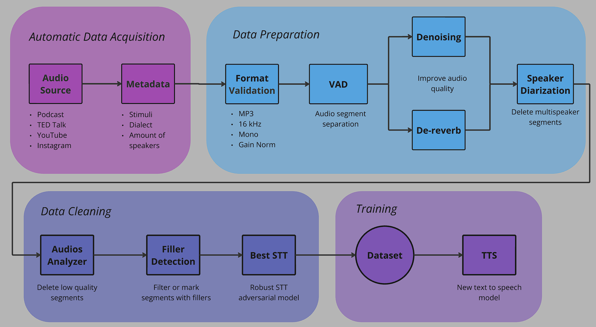

# Low Cost pre-processing pipeline for ITW datasets generation

This repository contains an algorithm to select the best sections of noisy speech datasets, enabling the creation of high-quality datasets for ASR tasks.

## Pipeline diagram


## Folder Structure

All data folders are located inside the main `Data` directory. You can automatically create all required folders using the script `Utils/create_folder_structure.py`.

- **Audio_to_Process**: Place new audios here to be processed. After processing, files are moved to the raw audios folder and this folder is emptied.
- **Audios_Raw**: Contains raw audios to be processed (e.g., podcasts, videos). Files are renamed with an ID and name separated by `_`.
- **Audios_VAD**: Contains subfolders for each long audio, with segments (chunks) named by audio ID and chunk number.
- **Audios_Denoise**: Contains denoised audios.
- **Audios_Clean**: Contains audio segments that passed quality filters. Also includes a `removed` subfolder for tracking discarded audios.
- **Audios_Transcript**: Contains segments with the best transcriptions. Also includes a `transcripts` subfolder for transcript CSVs.
- **Dataset**: Contains all the best fragments, merged into a single dataset.

## Main Configuration (`config.yaml`)

The `config.yaml` file allows you to adjust key parameters for each stage of the processing chain. Options include:

- **Global**
    - `test`: Enable or disable test mode.
    - `verbose`: Enable or disable verbose output.

- **VAD (Voice Activity Detection)**
    - `mean_duration`: Mean duration for audio segments (seconds).
    - `std_desv`: Standard deviation for segment duration.

- **Quality Prediction**
    - `type`: Mos predictor model ("NISQA" or "DNS MOS").
    - `threshold`: Quality threshold for audio selection.
    - `max_seconds`: Maximum duration for audio segments.
    - `min_seconds`: Minimum duration for audio segments.
    - `num_workers`: Number of workers for batch processing.
    - `batch_size`: Batch size for processing.

- **Denoising**
    - `type`: Denoising model ("None", "Demucs" or "DeepFilterNet").

- **Transcription (STT)**
    - `type`: Only Whisper model at the moment (working on more accurate alternatives).
    - `model_size`: Whisper model size ("Small", "Large", "Turbo").

- **Speaker Diarization**
    - `osd_min_overlap_sec`: Seconds threshold to consider an audio "dirty" from Overlapped Speech Detection.
    - `verification_cluster_method`: The clustering algorithm, which can be 'agglomerative' or 'spectral'.
    - `verification_agglomerative_threshold`: Cosine distance threshold used for agglomerative clustering.
    - `verification_spectral_min_clusters`: The minimum number of clusters for spectral clustering.
    - `verification_spectral_max_clusters`: The maximum number of clusters for spectral clustering.

You can modify these parameters in `config.yaml` to change how the pipeline processes your audio data.

## Installation

**Recommended: Poetry** — use Poetry to create and manage the project venv, install core pipeline deps, and optionally add the heavy metric libraries used to reproduce the paper’s evaluation.

From the project root copy-paste the appropriate commands:

### Install **pipeline only** (lightweight — recommended for dataset generation / production)
Use this if you only need the preprocessing pipeline (VAD, segmentation, denoising hooks, transcription hooks). This keeps the environment small and fast to install.
```bash
poetry install
```

### Add metrics (heavy — only if you want to run the paper’s evaluation methodology)

Add this command to calculate evaluation metrics as proposed in our paper.
```bash
poetry run pip install .[metrics]
```

### (Optional) Pip Installation
Plain venv + pip (if you don’t use Poetry). Create a virtual environment and install with pip:

```bash
python -m venv .venv

# macOS / Linux
source .venv/bin/activate

pip install --upgrade pip setuptools wheel

# pipeline only
pip install .

# pipeline + metrics (installs core + heavy metric libs)
pip install .[metrics]
```
##  Prerequisites: Hugging Face Token

To use the **Speaker Diarization** stage (Overlapped Speech Detection & Speaker Verification), you need a Hugging Face access token because the Pyannote models are gated.

1.  **Get a Token**: Create a "Read" token in your [Hugging Face Settings](https://huggingface.co/settings/tokens).
2.  **Accept Conditions**: Visit these model pages and accept the user conditions:
    * [pyannote/segmentation-3.0](https://huggingface.co/pyannote/segmentation-3.0)
    * [pyannote/speaker-diarization-3.1](https://huggingface.co/pyannote/speaker-diarization-3.1)
    * [pyannote/overlapped-speech-detection](https://huggingface.co/pyannote/overlapped-speech-detection)
3.  **Set the Environment Variable**:
    Before running `main.py`, export the variable in your terminal (or handle it with a .env file):

    ```bash
    # Linux / Mac
    export HF_TOKEN="your_hf_token_here"
    
    # Windows (PowerShell)
    $env:HF_TOKEN="your_hf_token_here"
    ```

## Running the pipeline
Follow this step to use the pre processing pipeline:

1) Initialize the folder structure with `Utils\create_folder_structure.py`. 
2) Upload the raw data to `Data\Audios_Raw`. 
3) Configuration of the pipeline can be done in the `config.yaml`
4) Execute the pipeline with `main.py`

## Evaluation of the pipeline
Once you have a pre processed dataset with ours or any pipeline, use `Metrics\composite_metric.py` that receives the original dataset and the processed dataset and computes the final score to this particular pre processing variant.

## Citing this work
If you use this repository or the evaluation methodology, please cite the paper. BibTeX entry below.

```bibtex
@ARTICLE{low-cost-ITW-2025,
  title        = "Evaluation of preprocessing pipelines in the creation of in-the-wild {TTS} datasets",
  author       = "Di Bernardo, Mat{\'\i}as and Misley, Emmanuel and Correa, Ignacio and Iacovelli, 
  Mateo Garc{\'\i}a and Mellino, Sim{\'o}n and Gonzales Barrios, Gala Luc{\'\i}a",
  year         =  2025,
  primaryClass = "eess.AS",
  eprint       = "2510.03111"
}
```